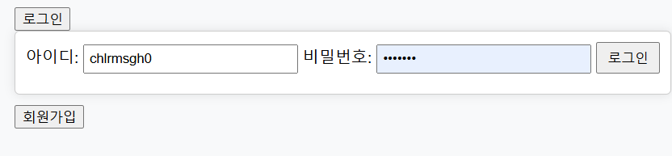
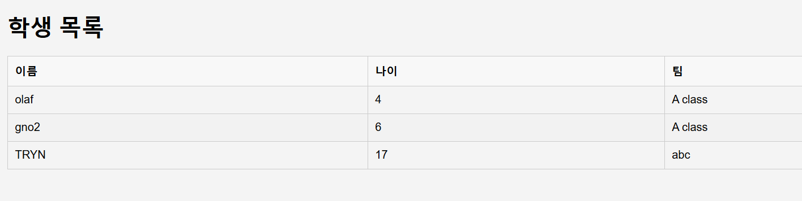
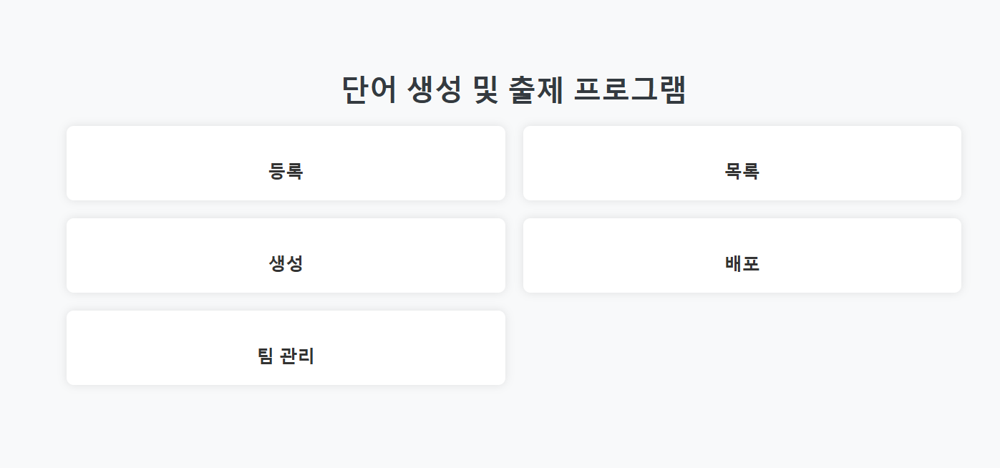
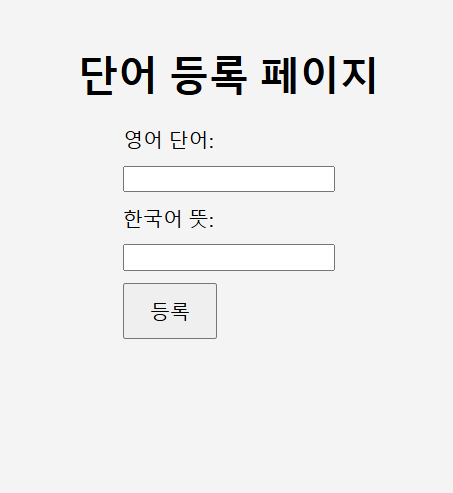
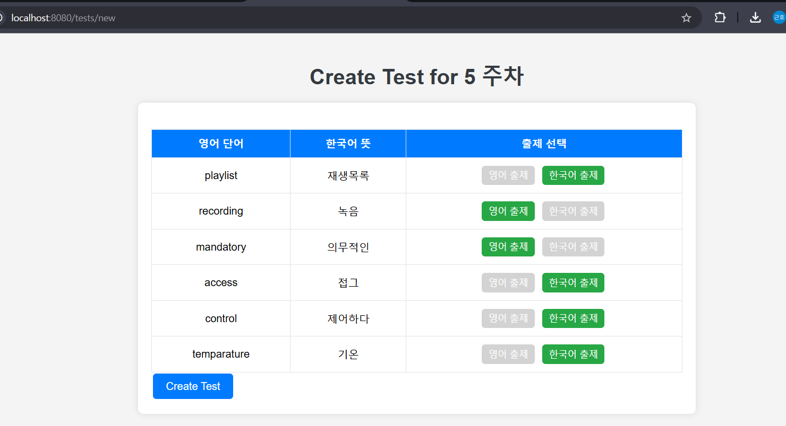

# VocaTestGenerator

내가 원하는 단어를 단어장에 등록하고 시험지를 생성하여 문제를 출제한다. 그리고 원하는 학생 그룹에게 단어를 배정할 수 있다!

---

# 1. 주요 Prefix 구성

## 1.1 기능 개발 (Feature)
새로운 기능이나 개선 작업과 관련된 이슈:

- **[feature]** 새로운 기능 개발
- **[enhancement]** 기존 기능 개선
- **[ui]** 사용자 인터페이스 개선
- **[backend]** 백엔드 기능 추가

## 1.2 버그 관리 (Bug)
오류 수정이나 문제 해결과 관련된 이슈:

- **[bug]** 치명적 버그
- **[minor-bug]** 경미한 버그
- **[critical]** 긴급 수정 필요
- **[test]** 테스트 관련 오류

## 1.3 문서화 (Documentation)
문서 작성 및 수정과 관련된 이슈:

- **[docs]** 코드 문서화
- **[readme]** README 업데이트
- **[api-docs]** API 문서 추가

## 1.4 기술적 문제 (Tech/Refactor)
리팩토링 또는 기술적 논의와 관련된 이슈:

- **[refactor]** 코드 리팩토링
- **[tech]** 기술 스택 논의
- **[debt]** 기술 부채 제거

## 1.5 테스트 및 품질 관리 (Testing)
테스트 관련 작업:

- **[test]** 유닛 테스트 작성
- **[qa]** 품질 보증 테스트
- **[integration]** 통합 테스트 추가

## 1.6 프로젝트 관리 (Chore/Meta)
관리 작업 및 메타 이슈:

- **[chore]** 프로젝트 설정 작업
- **[meta]** 프로젝트 관련 논의
- **[dependencies]** 종속성 업데이트

---

# 2. 프로젝트 문서

아래는 프로젝트의 전반적인 내용을 다룬 문서입니다. 문서를 통해 프로젝트의 개요, 요구사항, 그리고 최종 결과물을 확인할 수 있습니다:

1. [최종 보고서](보고서/최종보고서.md)  
   - 프로젝트의 성과와 결론을 정리한 문서입니다.

2. [프로젝트 개요 문서](보고서/프로젝트개요문서.md)  
   - 프로젝트의 목적, 배경 및 주요 목표를 설명한 문서입니다.

3. [요구사항 및 배운점](보고서/요구사항및배운점.md)  
   - 요구사항과 프로젝트를 진행하며 학습한 점을 다룬 문서입니다.
  
# 3. 화면 미리보기
   - **화면:** 주요 페이지나 화면 구성 요소 소개.
   - 사용자 관리(회원가입, 로그인)LoginCotroller
     
     

   - 학생 관리 (학생 등록, 팀 관리)StudentControllerTeamController.
     

   - 단어 관리 (단어 등록, 단어 조회)VocaController.
     
     

   - 테스트 생성 및 배포 (핸드아웃 기반 테스트 제작)TestControllerTest.
     
