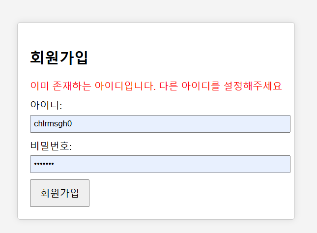
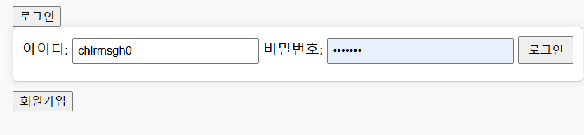
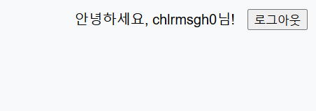
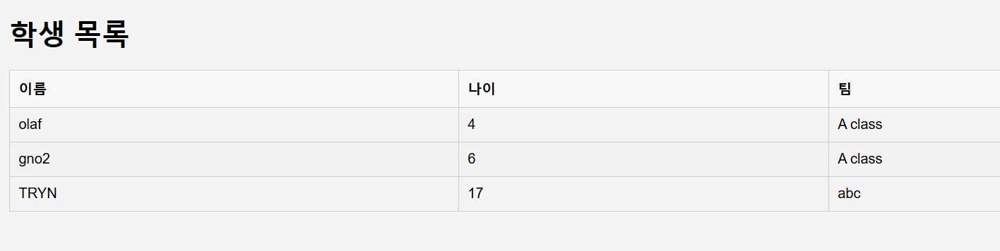
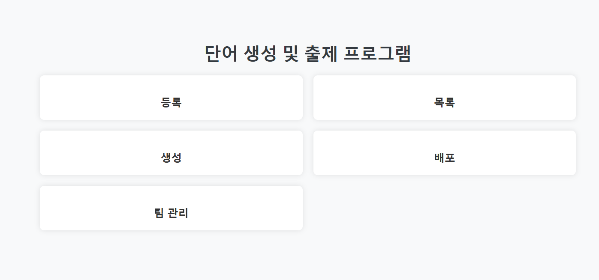
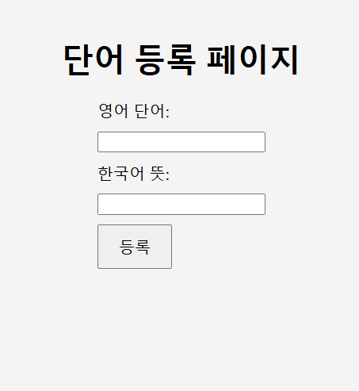
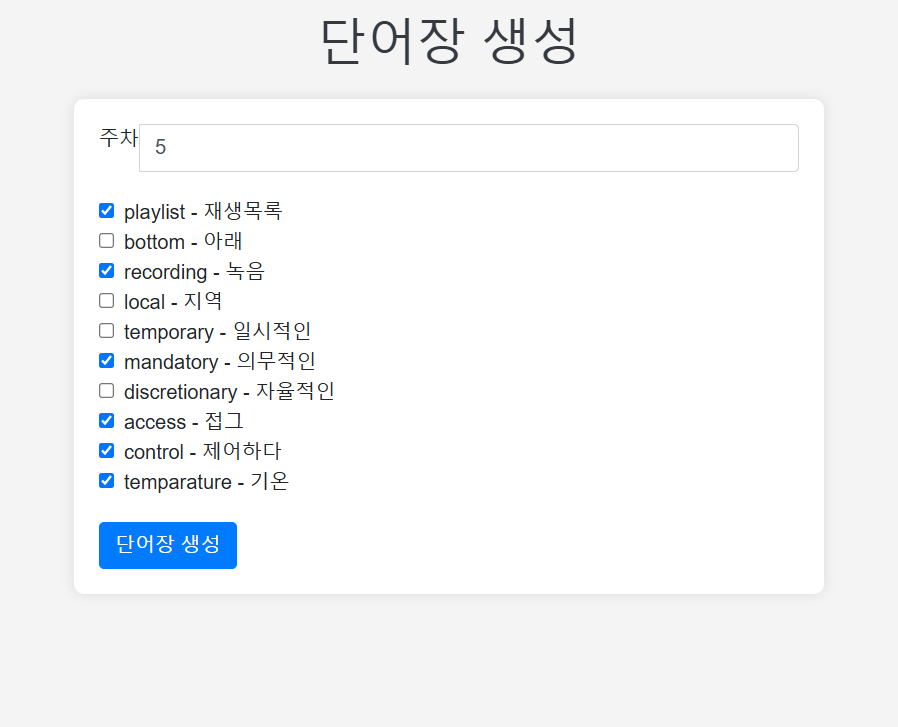
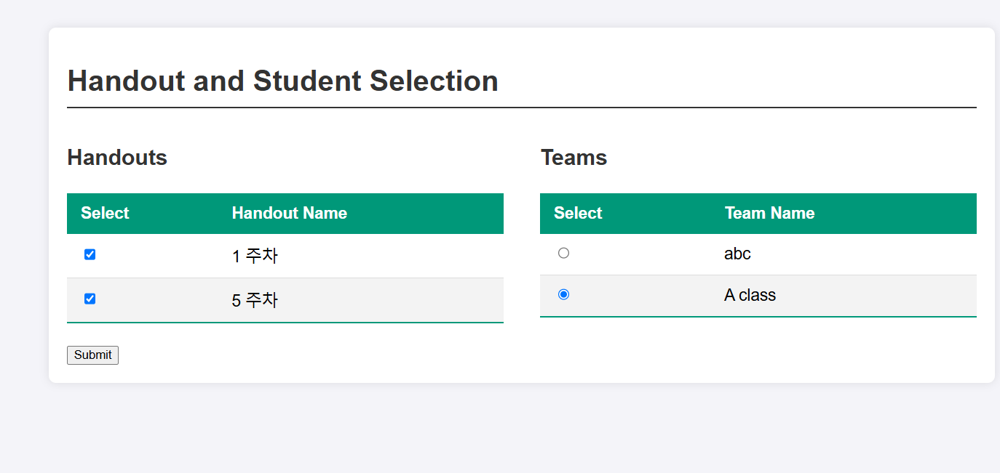
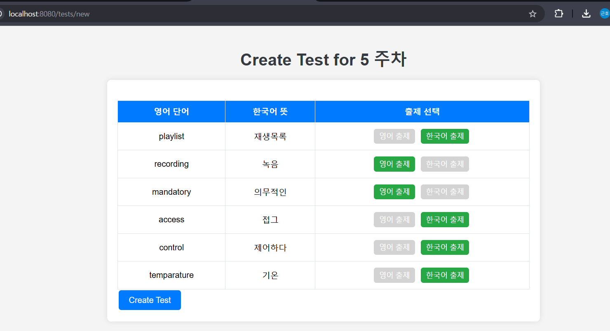
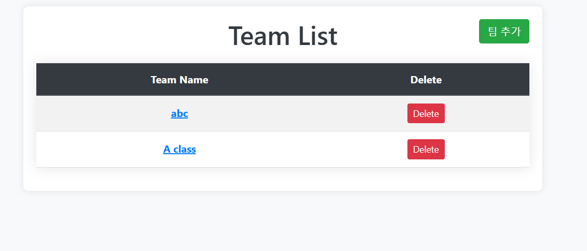

# [project] VocaGenerator 최종 문서

---

## 프로젝트:  VocaTestGenerator

## 개발자: 최근호(1인)

## 개발기간: 3주(20240716\~20240723, 20241216\~20241222)

---

# 목차

**I. 프로젝트 소개**

1.1 프로젝트 개요

1.2 개발 동기 및 배경

1.3 프로젝트 목표

**II. 핵심 기능**

2.1 사용자 관리

2.2 어휘 관리

2.3 핸드아웃 생성 및 관리

2.4 테스트 생성 및 배포

**III. 기술 스택**

3.1 백엔드 기술

3.2 데이터베이스 설계

3.3 프론트엔드 기술

**IV. 설계 및 구현**

4.1 MVC 패턴 적용

4.2 데이터베이스 구조

**V. 가치와 기대 효과**

5.1 사용자 측면의 가치

5.2 시스템 측면의 가치

5.3 기대 효과

**VI. 성과와 결론**

6.1 주요 성과

6.2 프로젝트 한계 및 개선 방향

- **부록**
7.1 기획서
    
    7.2 요구사항 및 배운점
    

---

# 본문

### **I. 소개**

- **프로젝트 개요:**
    
    본 어플리케이션은 웹사이트의 형태로 구현되며 영어 과외 아르바이트를 하는 대학생을 보조하는 것을 주 목적으로 한다. 구체적으로, 영어 과외생의 업무 중 하나인 영어 단어과제 생성을 돕고자 한다. 
    
     과외 학생들을 수준별로 분류하고 시험지를 생성하고 각 수준의 학생들에게 배포하는 과정을 보다 직관적으로 웹 환경에서 관리할 수 있도록 지원하고자 한다.
    

### **II. 핵심 기능**

- **기능 리스트:**
    - 사용자 관리(회원가입, 로그인)LoginCotroller
    - 학생 관리 (학생 등록, 팀 관리)StudentControllerTeamController.
    - 단어 관리 (단어 등록, 단어 조회)VocaController.
    - 핸드아웃 생성 및 관리 (단어 리스트 생성, 배포)​HandoutController.
    - 테스트 생성 및 배포 (핸드아웃 기반 테스트 제작)TestControllerTest.
    - 클래스(팀) 관리TeamController
- **화면:** 주요 페이지나 화면 구성 요소 소개 (스크린샷 포함 추천).
    - 사용자 관리(회원가입, 로그인)LoginCotroller
        
        

        
        

    - 학생 관리 (학생 등록, 팀 관리)StudentControllerTeamController.
        

    - 단어 관리 (단어 등록, 단어 조회)VocaController.
        
        

    - 핸드아웃(단어장) 생성 및 관리 (단어 리스트 생성, 배포)HandoutController.
        
        
        

        
        
        단어장 배포
        
    - 테스트 생성 및 배포 (핸드아웃 기반 테스트 제작)TestControllerTest.
    
    
    
    핸드아웃 기반으로 테스트 생성
    
    - 클래스(팀) 관리TeamController
        
        
        

### **III. 기술 스택**

- **웹서버:** Spring Boot, JPA, Spring Security
- **데이터베이스:** H2 → MySQL(변경)
- **화면 렌더링:** Thymeleaf.

### IV. **설계 및 구현**

- **설계 구조:** MVC 패턴.
- **데이터베이스 설계:** 주요 엔티티와 관계 설명 (ERD 다이어그램 포함).
    - 예: `Student`, `Team`, `Handout`, `Voca` 등​Team​Handout​Voca.

### **V. 가치와 기대 효과**

- **가치:** 프로젝트가 제공하는 실제적인 이점.
    - 사용자 측면의 가치
        
        직관적인 사용자 및 과제 관리.
        
        : 영어 과외 아르바이트를 하는 튜터를 대상으로, 튜터별 개인화된 단어 목록과 단어장을 쉽게 생성하도록 도와주며 다양한 유형의 테스트를 빠르고 직관적으로 제공한다. 
        
        또한 자신이 담당하는 학생을 손쉽게 관리하며 각각의 학생을 수준별로 분류하고 이들에게 배포된 현황을 직관적으로 파악가능하다. 이로써 튜터는 자신의 담당 과외생에게 부여된 과제와 시험을 한눈에 파악할 수 있다. 
        
        이는 기존의 프로젝트 목적인 과외 튜터의 업무 보조를 잘 수행하는 것을 보인다.
        
    - 시스템 측면의 가치
        
        : MVC패턴을 이용하여 보다 빠른 시간 안에 사용자 요청처리 기능을 개발 완료하였다. 또한 소규모 프로젝트이기에 자원이 제한되어 있으므로 집중형 아키텍처를 활용하여 서버의 안정성과 유지보수의 편이성을 살렸다.
        
- **기대 효과:** 사용자의 만족도 증대, 학생 및 과제 관리의 효율성

### **VI. 결론**

- **성과:**
    - 자체 로그인을 구현하며 spring security의 구조를 학습하였음.
    - 많은 엔티티를 관리하며 효율적인 DB설계란 무엇인지 고민하는 계기가 됨.
- **한계와 발전 방향:**
    - 관리 기능 추가 필요.
        - 주로 삭제가 잘 이루어 지지 못하는 걸로 보임.
            
            ex) 학생, 단어, 단어장, 테스트
            
    - 중복 데이터 방지가 필요.
        
        ex) 한 단어장을 같은 팀에게 여러번 배포가 가능함. → 중복 배포 방지 알림이 필요
        

# 부록

[기획서](보고서/기획서.md)
[요구사항 및 배운점](보고서/요구사항및배운점.md)
